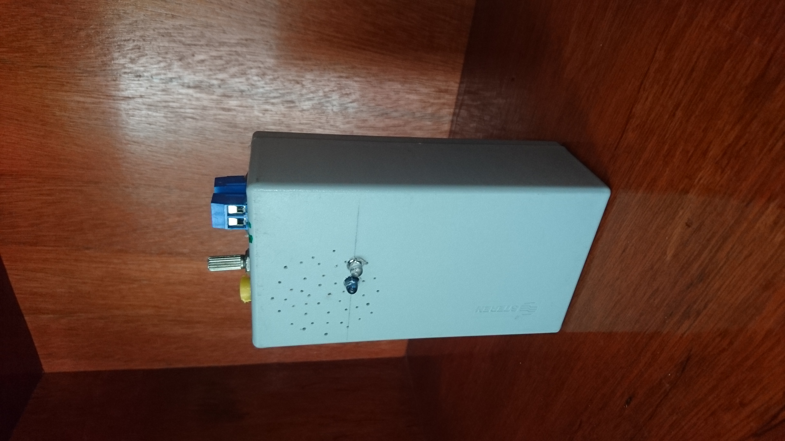
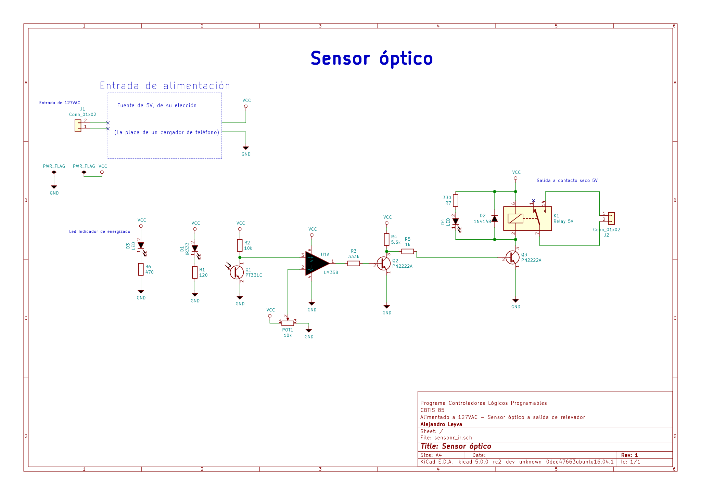

# Sensor IR with LM358

Project designed with [KiCAD](https://www.kicad.org)

## Details about develop

[Calculate](Calculator/Calculator.pdf)

## Bills of Materials

- 1 LM358N
- 2 2N2222
- Led Infrared IR333
- Phototransistor PT331C
- Resistors 10k, 333k,5.6k, 1k
- 1 Potentiometer 10k
- 1 Relay 5VDC 

## Download

Download the schematic diagram [here](dist/sensonr_ir.pdf)

## Photos

## Schematic

